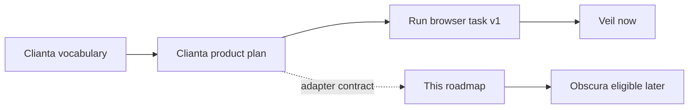
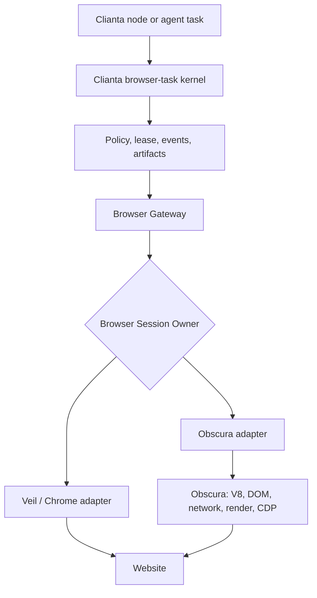
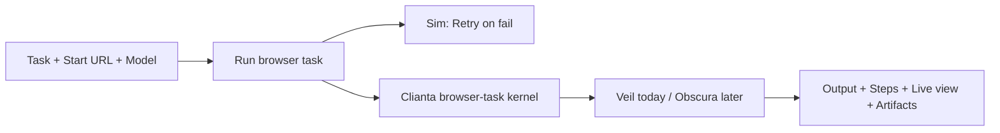
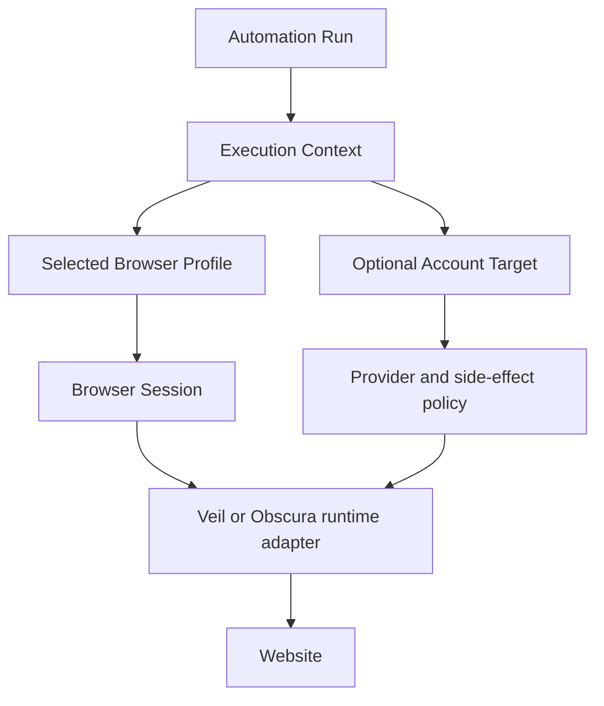
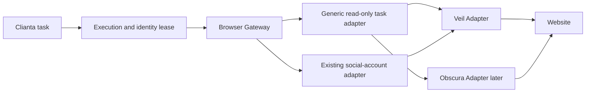

# Obscura + Clianta browser runtime roadmap

Status: historical companion runtime plan from 2026-09-13, preserved during 2026-09-30 consolidation. Later Browser Task implementation includes an opt-in Obscura adapter; this document is planning history, not its current delivery status.

Date: 2026-09-13

**Active-delivery note:** the current four-day Clianta proof ships on Veil. No
Obscura code is required or scheduled until that user-facing node has proved its
value.

This roadmap turns the Browser Use experiment and the existing Clianta browser-task kernel into a plan for using Obscura as a possible browser runtime for Clianta.

It is intentionally not a plan to clone Browser Use. The goal is to keep Obscura a deep browser engine while Clianta owns automation, identity policy, account integrations, and product workflows.

## Plan hierarchy

The plans have a deliberate one-way dependency:

| Source | Owns |
| --- | --- |
| Clianta `CONTEXT.md` | Product vocabulary, including Browser Profile, Cookie Observation, Connected Account, Account Target, and Browser Session |
| Clianta `clianta-browser-use/IMPLEMENTATION_PLAN.md` | The `Run browser task` node, policy, session dispatch, Sim integration, and release sequence |
| This roadmap | Obscura's adapter, browser-state bridge, compatibility scope, and identity/runtime evidence |

From the Clianta repository root, the companion product plan is
`clianta-browser-use/IMPLEMENTATION_PLAN.md`; from this checkout it lives in
the sibling Clianta repository. This document must not redefine the node's
fields, permissions, or rollout order. It makes Obscura eligible only after
Clianta's product gates have been met.



## Executive decision

The existing Clianta kernel already owns much of the browser-task control plane. Obscura is therefore not being asked to become a second Browser Use product. It is being evaluated as a swappable browser runtime behind that control plane.

Obscura is a viable future runtime for Clianta if the target is:

- CDP-controlled browser automation
- DOM and JavaScript workflows
- rendering and screenshots
- isolated browser contexts
- controlled profile-state persistence
- per-context network and identity configuration

Obscura is not yet a drop-in replacement for real Chrome for every possible workflow. The project becomes much larger if Clianta requires:

- arbitrary Chrome extension compatibility
- complete Playwright parity
- OS-level browser behavior
- Chrome's entire CDP surface
- Chrome-compatible `user-data-dir` semantics
- every download, permission, service-worker, and authentication edge case

The recommended strategy is therefore:

```text
Clianta owns the automation product.
Obscura owns the browser runtime.
Veil remains an alternative runtime adapter.
```

## What the existing Clianta kernel changes

The `clianta-browser-use` work is a private TypeScript browser-task kernel, not an upstream Browser Use clone. The kernel already provides much of the control plane around a browser runtime:

- run state, cancellation, takeover, resume, idempotency, and ordered events
- durable local execution state and restart reconstruction
- brokered CDP access with method and target authorization
- URL/DNS policy and private-network protection
- sandboxed JavaScript
- tenant-confined workspaces and artifact integrity checks
- secret redaction and capture fencing
- saved-script replay and bounded repair
- CAPTCHA lifecycle interfaces
- browser profile/session leases and identity reauthorization

This removes those concerns from the Obscura engine roadmap. It does not remove the need for an Obscura adapter, browser-state compatibility, Chrome/CDP behavior, or a production Clianta product surface.



### Saved from the Obscura roadmap

Obscura does not need to implement these as engine features:

- task planning and product-level run state
- scheduling, billing, and hosted provisioning
- human takeover policy
- task-level account permissions
- workspace and artifact management
- secret management and redaction
- replay and repair policy
- CAPTCHA provider orchestration
- generic connector management

### Still required

- the Obscura Browser Session Owner adapter
- DOM, JavaScript, navigation, network, rendering, and CDP behavior
- browser contexts, cookies, storage, and lifecycle semantics
- import/export of the neutral Browser State contract
- a shared conformance suite for Veil and Obscura
- production persistence and a Clianta dispatcher/UI

The kernel is the control plane. Obscura is the runtime implementation behind a small, deep session interface.

## Browser Use-style UI mapping

Browser Use-style controls should issue commands to the Clianta kernel. They should not bypass the kernel and call Obscura directly.

The canonical v1 field list and Browser Use feature-adoption decisions live in
Clianta's implementation plan. This section maps those product choices to a
runtime effect and must stay subordinate to that plan.

| UI control | Kernel command | Runtime effect |
| --- | --- | --- |
| Launch browser | create session lease | start Veil or Obscura |
| Browser Profile | select first-party browser resource | load its neutral state, identity, and route through policy |
| Detected cookies | inspect the selected profile state | report evidence, not an account claim |
| Account target | authorize side-effect target | require provider/account policy |
| Run browser task | create run | enter the state machine |
| Pause / take over | suspend or transfer lease | current design resumes from persisted state; exact live-tab transfer is a later capability |
| Resume | continue run token | continue with the current lease or reopen from the same persisted Browser Profile state |
| Stop | cancel and release | stop the runtime and persist state |
| Live view | open guarded preview | expose approved session observation |
| Events / artifacts | read journal and outputs | show results, redacted Steps, screenshots, and downloads |
| Share run | create explicit, scoped share link | never publish a run automatically |
| Schedule | create recurring run | remain in Clianta, outside Obscura |

The first product slice should be:

```text
   [Run browser task]
    -> Clianta kernel
    -> policy checks
    -> Browser Gateway
    -> Veil adapter today / Obscura adapter when eligible
    -> website
    -> events, artifacts, and result
```

### The native `Run browser task` node

Clianta should create this node. It should look familiar to someone who has used
the Sim Browser Use node, but call Clianta's signed browser-task endpoint rather
than Browser Use's hosted API.



#### Initial editor fields

| Visible label | Initial behavior | Why it belongs here |
| --- | --- | --- |
| **Task** | Required natural-language browser job | Same clear name as Browser Use |
| **Start URL** | Optional first page | Same clear name as Browser Use |
| **Model** | Explicit picker, prefilled from the workspace default | Builders should be able to choose it just as they can elsewhere in Clianta |
| **Browser Profile** | Required first-party selector, never a raw Profile ID | Selects durable browser state, not a claimed social account |
| **Allowed Domains** | Optional domain boundary | Same clear name as Browser Use; enforced by the kernel |
| **Max Steps** | Advanced bounded execution limit | Prevents accidental open-ended runs |
| **Vision**, **Thinking**, **System Prompt Extension** | Standard model-dependent controls | Expose only the existing Sim controls that the selected planner actually supports |
| **Structured Output Schema** | Advanced typed result contract | Lets later nodes consume a reliable result |
| **Retry on fail** | Existing Sim per-block control | Keeps retry behavior consistent across the editor |

Do **not** copy these Browser Use provider fields into the native node:

- `API Key`: Clianta owns the native capability and its credentials.
- `Profile ID`: a raw runtime identifier is not a useful or safe graph input.
- provider-specific `Flash Mode`: add only if a supported Clianta planner has a
  real equivalent.
- country, custom proxy, recording, timeout, fixed viewport, and resize
  controls: these remain later policy/product decisions, not v1 fields.

`Browser Profile` is the product-facing selection. Its persisted browser state
is neutral: selecting it never makes the node say
"this is an Instagram account" merely because it detects an `instagram.com`
cookie.

V1 intentionally has no `Browser Mode` selector. There is no research-route
allocator yet, so a public task must use the selected eligible Browser Profile
or report that it cannot run. A future research mode belongs behind a dedicated
allocator, not a toggle that silently changes route or identity.

#### Outputs are not settings

The Browser Use node's `steps`, `liveUrl`, `shareUrl`, and `sessionId` are output
fields returned after a run. They are not inputs in its settings panel.

For the native node, expose:

| Output | Product behavior |
| --- | --- |
| `id`, `success`, `output` | Standard typed run result |
| `steps` | Redacted, structured action/event trace; never raw private planner memory |
| `liveUrl` | Authenticated, time-bounded live observation while a run is active |
| `sessionId` | Internal correlation/debugging identifier, available to authorized operators |
| `artifacts` | Screenshots, downloads, extracted data, and evidence under workspace ACLs |
| `shareUrl` | Created only by an explicit **Share run** action with expiry, ACL, and redaction checks |

That differs deliberately from the external Browser Use provider node, which can
return a provider-generated public share URL. A Clianta connected browser may
contain private state, so public sharing cannot be the default.

#### Retry is one shared Sim feature

Use Sim's existing per-block retry surface rather than inventing a second
browser-only switch:

```text
Retry on fail        [on/off]
  Max tries          2–5, default 3
  Wait between tries 0–5000 ms, default 1000 ms
```

At the Sim executor layer, this is intentionally a broad retry mechanism: a
normal failure retries unless the block reports a deliberate stop, a nested
workflow outcome, or a `NonRetryableExecutionError`. The native browser-task
endpoint must therefore classify these before returning to Sim:

- user cancellation, pause, takeover, or approval required -> non-retryable;
- an ambiguous side effect (for example, a post might already have sent) ->
  non-retryable unless an idempotency/outcome check proves a retry safe;
- ordinary pre-action/navigation/runtime failures -> eligible for the standard
  Sim retry.

This is the same editor and executor contract as Sim, with a safe browser
adapter at the boundary. It is separate from an agent's internal workflow
repair attempt: **Retry on fail** replays the block; internal repair adjusts a
failed plan before the block declares its outcome.

## The core model change

The incorrect product model is too account-centric:

```text
Account -> Browser Profile -> Browser Session
```

The product-facing model is:

```text
Browser Profile -> Browser Session -> Browser Context
Automation Run -> optional Account Target
```

An account is not automatically claimed merely because a cookie exists.

The internal ownership model remains:

```text
Browser Profile (durable identity and state owner)
  -> Browser State (neutral persisted state it exposes)
  -> Browser Session
  -> Browser Context
```

`Browser State` is deliberately not a second persistence system or the node's
visible primary noun. It is the neutral state held by the selected Browser
Profile.

### Canonical terms

#### Browser State

A neutral persisted browser environment owned by a stable Browser Profile. It
may expose or load:

- cookies
- local storage
- IndexedDB or equivalent state
- saved permissions
- browser identity configuration owned by the backing Browser Profile
- network route configuration owned by the backing Browser Profile
- optional runtime-owned user data

Browser State is neutral. It does not claim that an Instagram, Reddit, or X
account is connected, and it must not become a competing owner of the profile's
durable identity or route.

#### Cookie Observation

Evidence that a browser state contains cookies or storage associated with a domain.

Examples:

```text
Detected domain: instagram.com
Detected domain: reddit.com
Detected domain: x.com
```

This should be presented as detection, not as an account identity claim. A cookie can be expired, shared, invalid, or belong to the wrong account.

#### Connected Account

An explicit Clianta-level integration record for a provider account.

It should exist only when the user or an integration flow has intentionally identified and verified the account.

Examples:

```text
Instagram @brand
Reddit u/brand
X @brand
```

#### Account Target

An optional target on an automation or node that says which provider/account the action is intended to affect.

Generic browser nodes do not need one. Provider-specific side-effect nodes should usually require one.

#### Browser Session

A running browser runtime created from the selected Browser Profile and its
persisted Browser State. It owns process lifetime, CDP, pages, timeout,
takeover, resume, and shutdown.

#### Browser Context

An isolated mutable-state container inside the runtime. In Obscura it owns page state, cookies, storage, workers, headers, and other mutable session data.

## The node-editor recommendation

An explicit `AccountBinding` should not be required in every automation today.

That would make generic workflows unnecessarily account-aware and would make Clianta harder to use for research, development, scraping, testing, and internal tools.

The editor should use an optional execution context:

```text
Automation Run
  browser_profile: selected Browser Profile or none
  browser_state: the neutral state loaded from that profile
  route: inherited route or explicit route policy
  identity: inherited identity policy
  account_target: optional provider/account target
```

Then nodes declare their requirements:

| Node type | Browser Profile | Account Target |
| --- | --- | --- |
| Open URL | Optional | No |
| Extract text | Optional | No |
| Take screenshot | Optional | No |
| Search Reddit | Optional | Usually no |
| Read Instagram inbox | Required | Provider target recommended |
| Publish Instagram post | Required | Explicit target required |
| Send X message | Required | Explicit target required |
| Run arbitrary JavaScript | Optional | No by default, policy-controlled |

The runtime flow becomes:



For a provider-specific action, Clianta can verify the target before allowing a side effect. For a generic node, no account graph is involved. A detected cookie never creates an Account Target or a verified profile-account association.

## Multiple accounts in one Browser Profile

One Browser Profile may contain several accounts when the user intentionally wants them co-resident:

```text
Brand Browser Profile
  - Instagram @brand
  - Reddit u/brand
  - X @brand
```

But this must not be assumed automatically. Some accounts should have dedicated state:

```text
Personal Browser Profile
  - personal Gmail
  - personal Reddit

High-isolation Browser Profile
  - one account only
```

The long-term relationship can be represented as an optional internal record:

```text
Browser Profile <-> Connected Account
```

This is useful for policy and verification, but it should not be the primitive required by every node.

## Where the higher-level features go

Browser Use-like features can eventually exist in Clianta, but they belong in separate Clianta modules rather than in Obscura.

```text
Clianta
├── Browser Profile module
├── Cookie Observation module
├── Connected Account module
├── Automation / Agent Runtime module
├── Workspace / Artifact module
├── Scheduler module
├── Route / Proxy module
├── Provider Integration modules
├── Human-in-the-loop module
└── Browser Session Owner
    ├── Veil Adapter
    └── Obscura Adapter

Obscura
├── Browser engine
├── Page and context lifecycle
├── JavaScript and DOM
├── Network and request interception
├── Rendering
├── CDP
├── Context isolation
└── Browser-state primitives
```

### Ownership rules

| Capability | Owner |
| --- | --- |
| Natural-language planning | Clianta Agent Runtime or external Browser Use adapter |
| Account records | Clianta Connected Account module |
| Cookie observations | Clianta Browser Profile module, using runtime inspection |
| Workspaces and artifacts | Clianta Workspace module |
| Scheduling | Clianta Scheduler module |
| Billing and usage | Clianta cloud/control plane |
| Proxy allocation | Clianta Route module or proxy provider |
| Browser execution | Obscura or Veil adapter |
| DOM, JavaScript, rendering, CDP | Obscura |
| CAPTCHA and human approval | Clianta policy and interaction modules |
| Provider integrations | Clianta provider modules |

Browser Use can remain an external implementation for hosted agents or hosted browsers. Obscura should expose the runtime primitives that Clianta needs regardless of which agent planner is used.

## Runtime seam

The real integration seam is the Browser Session Owner, but it has two safe
adapters rather than one permissive catch-all path:



The existing Clianta `BrowserProfileAutomationSession` is intentionally the
social-account adapter: its execution intent requires `instagram` or `x`, a
verified Connected Account, and a canonical social start URL. It must not be
made optional or broadened in place merely to launch a generic public website.

The new generic read-only adapter should stay small and deep. Conceptually it
needs to cover:

```text
open an eligible Browser Profile and load its Browser State
validate Start URL and Allowed Domains without social-network assumptions
acquire the exclusive profile lease and launch a coherent runtime
attach or expose CDP
execute browser operation
allow guarded observation; reopen safely from persisted state when needed
close and persist
```

It receives profile, run/purpose, Start URL, and Allowed Domains. It receives
no Connected Account, raw cookie, proxy credential, profile UUID from the
graph, or social-network enum. The existing social owner retains its stricter
association and route rules.

This also means the current social `launchCloudContext` path cannot be reused
unchanged for generic work: it receives a social navigation intent. Phase 0.5
must expose a policy-neutral launch/navigation seam before either Veil's generic
adapter or Obscura's future adapter can use it.

The interface must also define its invariants:

- which identity is fixed for the session
- which state is loaded
- which route is active
- what happens on crash
- whether state is persisted on close
- whether a pause/resume can safely preserve the same session or must reopen
  from persisted state
- how a lost route or identity change is reported

## Compatibility scope

Obscura should not implement every Chrome feature up front. Use capability tiers.

### Tier 0: Browser Use contract

Already demonstrated or close to demonstrated:

- CDP attach
- target metadata
- page navigation
- Runtime evaluation
- DOM query and snapshots
- input insertion
- screenshots
- browser contexts
- cookies and storage
- request interception

Exit condition: the reusable compatibility probe passes against Obscura and Clianta's Browser Gateway.

### Tier 1: Clianta workflow compatibility

Implement only what the current node editor and automations require:

- forms
- clicks and keyboard input
- popups and target lifecycle
- uploads and downloads if current nodes need them
- dialogs
- common authentication flows
- iframe and worker behavior
- stable screenshot capture

Exit condition: representative Clianta workflows run through the Obscura adapter without Veil-specific behavior.

### Tier 2: Operational browser features

Add when a real Clianta workflow requires them:

- richer permissions
- service workers
- file chooser semantics
- download management
- accessibility tree fidelity
- performance and network telemetry
- more complete browser-context behavior

Each feature needs a real workflow and a test before implementation.

### Tier 3: Chrome ecosystem compatibility

This includes:

- Chrome extensions
- extension background pages and service workers
- extension permissions
- browser UI integration
- broad Chromium-specific behavior

This is not a near-term requirement for Obscura-as-Clianta-runtime. Extension compatibility is possible only with significant additional implementation because Obscura is not Chromium and does not inherit Chrome's extension platform.

If Clianta eventually needs extension-heavy workflows, retain Veil as the adapter for those workflows while Obscura serves workflows that do not need extensions.

### Tier 4: Hosted browser platform

These do not belong in the Obscura engine:

- cloud browser provisioning
- live preview service
- recording storage
- billing
- API keys
- scheduled agent jobs
- hosted workspace storage

They belong in Clianta's cloud/control-plane modules or can be delegated to Browser Use.

## Stealth and identity roadmap

The Browser Use smoke test showed that a managed browser can expose a coherent runtime identity, but it was not a stealth audit.

The comparison dimensions are:

| Dimension | Browser Use | Clianta / Veil | Obscura today |
| --- | --- | --- | --- |
| Engine | Managed Chrome/Chromium | Persistent Chrome-based runtime | Custom Rust/V8/DOM engine |
| User agent | Cloud-managed | Stored per-profile | Built-in coherent Windows identity |
| Client hints | Managed by browser runtime | Runtime-checked against profile | Coherence tests exist |
| Timezone and locale | Cloud runtime configuration | Profile/runtime configuration | Locale is currently `en-US`; timezone is process-wide today, not a per-context profile setting |
| Network egress | Managed or custom proxy | Profile-specific route | Per-context proxy support; Clianta route bridge is incomplete |
| Browser state | Cloud Browser Profile | Persistent user-data state | Context state exists; neutral profile-state bridge is incomplete |
| Rendering | Real Chrome | Real Chrome | Custom renderer |
| Extensions | Chrome ecosystem | Chrome ecosystem | Not supported as Chrome extensions |

Focus order:

1. State persistence
2. Identity coherence
3. Network route consistency
4. Chrome/CDP workflow compatibility
5. Evidence harness
6. Profile-bound identity variation

Do not add random identity variation before the ownership and persistence model is stable.

Browser Use's product controls, such as window resizing and fixed viewport, are
useful hypotheses about a managed-browser launch contract. They are not proof
that the same toggle is safe or useful for Clianta. V1 should keep them out of
the node and instead evidence the chosen launch policy.

### Evidence gates

| Level | Required proof | Consequence |
| --- | --- | --- |
| **L0: Clianta v1 launch receipt** | Redacted profile reference, binary/version, approved launch provenance, viewport/resize policy, UA, UA-CH, platform, locale, timezone, route/observed egress, WebRTC/DNS exposure, and state persistence/release. | Reject mismatch or route loss; do not call it a stealth score. |
| **L1: public safe workflow** | A no-account public task survives a clean stop/reopen with no cross-profile or cross-tenant state leak. | Required before founder-facing v1 readiness. |
| **L2: diagnostics** | Clean versus instrumented receipts on detector sites, inspected row by row for IP, WebRTC/DNS, proxy, timezone, locale, geo, headless/CDP, WebGL, fonts, and storage. | Regression signal only, never a detector-score acceptance gate. |
| **L3: Obscura eligibility** | Obscura can reproduce the selected profile's compatible state and identity contract per context, or explicitly declines the run. | Required before the policy may choose Obscura for that profile. |

Until L3, no profile silently moves from Veil to Obscura. A mismatch is an
eligibility failure, not an excuse to randomize identity or substitute route.

## Roadmap phases

### Phase 0: Lock the vocabulary

Deliverables:

- agree that Browser State is neutral persisted data, not a second owner
- retain Browser Profile as the durable owner and product-visible selector
- distinguish Cookie Observation from Connected Account
- make Account Target optional for generic nodes
- define which provider nodes require verified targets
- lock the node's visible labels: `Task`, `Start URL`, `Model`, and `Allowed Domains`
- keep raw Browser Profile IDs out of graphs and show Cookie Observations as evidence only

Decision gate:

```text
Do we agree that a cookie observation is not an account connection?
```

### Phase 0.5: Build the safe generic Veil seam for the native node

The kernel is already a real foundation. Its integration surface must become
trustworthy before it powers a founder-facing node, but the first native node
does not need to wait for the Obscura adapter. It must first add a generic,
read-only task adapter that uses Veil without weakening Clianta's existing
social-account Browser Session Owner.

Deliverables:

- approve the Node Gate card and freeze the Gate 2 thin-slice contract in the
  canonical Clianta implementation plan
- fix the localhost fake Browser Profile typecheck drift
- fix the E2E teardown assertion where `contextCloses` remains zero
- define and test the generic read-only adapter: eligible profile, run/purpose,
  Start URL, Allowed Domains, exclusive lease, generic route policy, coherent
  launch, persistence, and stop/recovery
- preserve the existing Instagram/X + verified Connected Account owner exactly
  as its stricter sibling
- document the command/event contract used by the web UI
- implement the node fields and typed outputs only as specified by the
  canonical Clianta implementation plan
- use Sim's existing `Retry on fail` policy and outcome classification, not a browser-specific retry system
- keep the first UI surface limited to launch, run, guarded observation,
  safe reopen/resume, stop, live view, events, and artifacts
- do not expose raw CDP, profile UUIDs, API keys, proxy internals, or account cookies in the graph

Exit condition:

```text
One no-account public task can be started, observed, retried safely, stopped,
and safely reopened from persisted state through the native node without
leaking a session or weakening a social-account boundary.
```

### Phase 1: Sidechat profile-state contract

Deliverables:

- inventory Clianta's current persistent profile data
- define a portable state manifest
- map cookies, storage, proxy, identity, and permissions
- list Chrome `user-data-dir` assumptions
- identify what Obscura can import/export
- create persistence fixtures

Non-goals:

- no account-model rewrite
- no production Obscura adapter
- no identity randomization
- no real social accounts

### Phase 2: Browser comparison harness

Run the same probe against:

- Browser Use Cloud
- Clianta Veil
- Obscura

Compare:

- CDP operations
- DOM and runtime behavior
- navigation
- screenshots
- cookies and storage
- iframe and worker state
- client hints
- timezone and locale
- route and egress
- viewport and resize policy
- WebRTC/DNS exposure
- shutdown and restart

Capture the L0 launch receipt for every run and compare stable facts rather
than relying on a detector score. The Browser Use session is a reference point,
not an acceptance oracle.

### Phase 3: Obscura adapter

Implement the Obscura Adapter behind Clianta's **generic read-only** Browser
Session Owner adapter.

The `Run browser task` node and its workflow contract do not change at this
phase. Clianta swaps the runtime beneath the existing session-owner seam only
for no-account workflows that pass the compatibility, state-bridge, and L3
identity gates. If Obscura cannot represent the selected Browser Profile's
contract, the policy declines that route; it never silently substitutes an
identity or route.

First prove a no-account workflow:

```text
select Browser Profile
→ start Obscura
→ attach CDP
→ navigate
→ inspect DOM
→ persist state
→ stop
→ restart
→ recover state
```

### Phase 4: Obscura rollout through the existing node

Run representative, no-account, read-only automations through the same `Run
browser task` node with Obscura selected only by eligibility policy. The
builder should not have to redraw their workflow simply because the
implementation under the node changes.

Prioritize workflows that use:

- navigation
- forms
- extraction
- screenshots
- JavaScript evaluation
- browser contexts
- cookies and storage

Keep Veil available for workflows that require unsupported Chrome features.

### Phase 5: Optional account targeting

Add explicit Account Targets only where the workflow has meaningful provider-side effects:

- publishing
- sending messages
- deleting content
- changing account settings
- reading private account data

Before a side effect, Clianta should verify:

- selected Browser Profile
- expected provider
- expected account when known
- current login/session state
- allowed node capability

### Phase 6: Broader parity, only by demand

Implement Tier 2 or Tier 3 features only when a real workflow is blocked and the feature has a clear acceptance test.

## Immediate next actions

1. Approve the `Run browser task` Node Gate decision card in Clianta.
2. Freeze the Gate 2 contract for the generic read-only session adapter.
3. Stabilize the existing kernel's typecheck and teardown behavior and test the
   new generic-versus-social boundary.
4. Build the Veil-backed native node using standard Sim retry semantics and
   capture its L0/L1 evidence receipt.
5. Start the profile-state sidechat with the Phase 1 scope.
6. Build the comparison probe before adding more identity work.
7. Add the Obscura adapter only after the state bridge and L3 eligibility gate.
8. Add Account Targets only for provider-specific side effects.

## Final product shape

```text
Clianta
  automation intent
  node graph
  optional account targets
  Browser Profile selection
  provider policy
  workspaces and schedules
  browser-session ownership

Obscura
  browser runtime
  contexts and pages
  DOM and JavaScript
  network
  rendering
  CDP
  state primitives
```

The long-term goal is not to make every Browser Use feature part of Obscura.

The goal is to make Obscura a strong, swappable runtime behind a clean Clianta session seam, while keeping browser state neutral until a workflow explicitly needs an account claim.
